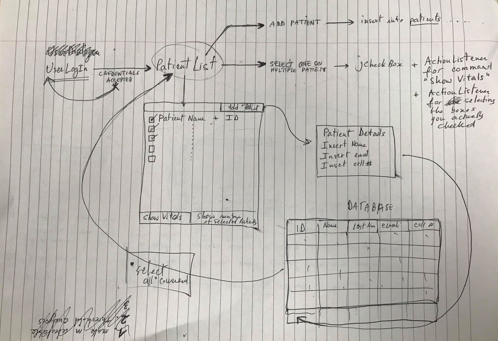

# Remote Patient Monitoring

	
	
	

Real-time patient visualisation of vital signs with a simple easy to read UI.

### Vitals requirements:

- [x] Body temperature
  - [x] Current temperature
  - [x] Normal
  - [x] Abnormal
- [x] Respiratory rate
  - [x] Current rate
  - [x] Normal
  - [x] Abnormal
- [x] Blood pressure
  - [x] Max & min pressure
  - [x] Normal
  - [x] Abnormal
- [x] ECG
  - [x] BPM (HR)
  - [x] Normal
  - [x] Abnormal

### Feature requirements:

- [x] A display of each vital sign plotted over the last n records, where n is selectable and display of ECG
- [ ] Visual alarms that indicate if the values are outside normal value
  - [ ] Warning
  - [ ] Urgent
- [ ] A permanent record (database) to be kept of average values for every minute during a day and also instances when there have been abnormal signs
- [x] A tunable App.simulation of the vital signs and ECG for the system to display:
  - [x] Simulate a normal patient
  - [x] Simulate a patient who has abnormal vital signs
  
  
### Feature desirables:

- [ ] The ability to monitor multiple patients at the same time - records to be kept of each patient's identity details
- [ ] Audio and email alarms
- [ ] Audio indication of heart beat
- [ ] A report generated of the average values recorded during a day, and when any abnormal signs happened

### Initial Feedback Suggestions:

- [ ] Add server to be able to remotely monitor patients.

---

## Prototypes:

### Simulation Branch:

### Patients Log Management:

### Examples from Industry:

### Our Progress:

#### First GUI:

#### GUI with custom signals:

